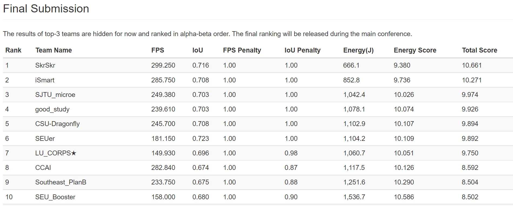

# SJTU_microe

This is a repository for FPGA-based neural network inference,  which delivered 70.3% Intersection over Union (IoU) and 249.380 fps with 4.95 W power consumption on Ultra96v2. The design won the third place in [the 58th IEEE/ACM Design Automation Conference System Design Contest (DAC-SDC)](https://dac-sdc-2021.groups.et.byu.net/doku.php). Designed by:

> SJTU_microe group, School of Electronic, Information and Electrical Engineering (SEIEE), Shanghai Jiao Tong University(SJTU)

> Peidong Du, Guochao Deng, Yaoyao Kong, Qin Wang, Naifeng Jing, Jianfei Jiang

The final rankings are published at https://dac-sdc-2021.groups.et.byu.net/doku.php?id=results



Our design bases on [UltraNet](https://github.com/heheda365/ultra_net), the champion design of [the 57th IEEE/ACM Design Automation Conference System Design Contest (DAC-SDC)](https://dac-sdc-2020.groups.et.byu.net/doku.php). Our contributions are as follows:

1. **DNN model optimization** 

* Since most of the images in the dataset have an object size of 1-2% of the captured images[[1]](https://arxiv.org/pdf/1809.00110.pdf), we add a bypass module to the original DNN model， which merges the feature maps of a shallow layer and a deep layer to improve the detection accuracy of small objects. The accuracy is improved from 65.6% to 70.3% with this optimization.

2. **Accelerator optimization**

* Improve DSP utilization: The DSP on the FPGA platform supports 27bits×18bits multiplication, and we quantize the weights and activations to 4 bits, so we map four 4-bit multiplications on a DSP to improve DSP utilization.
* Optimize the dataflow: We optimize the dataflow to adjust to the new DNN model and the above DSP optimization.
* Reduce the bandwidth: We reduce the bandwidth between different layers to the minimized requirement.

3. **System Optimization**

* Balance PS and PL: Since the throughput of PL is higher than that of PS, so we set the number of thread loading images to 8 and batch size of the accelerator to 64 to improve the speed of loading images, and we reduce the frequency of PL to 125MHz to adjust to PS.

## Repo organization

* training: The DNN model definition and training scripts.
* quantization: The script which process the model generation weights and configuration files to be used in Vivado HLS.

- hls: The DNN model implemented using Vivado High Level Synthesis (HLS), written in C++.
- script: The script to generate a Vivado block design. 
- deploy:  The bitstream for FPGA configuration and the Jupyter notebook showing how to use the DNN model to perform object detection on FPGA.

## Platform

[Xilinx Ultra96 V2](https://www.xilinx.com/products/boards-and-kits/1-vad4rl.html)

## Software prerequisites

[Vivado Design Suite - HLx Editions](https://www.xilinx.com/products/design-tools/vivado.html#overview)
[PyTorch](https://pytorch.org/)

## Build the bitstream from scratch

In this work, the DNN model implementation is written in C++ code. To deploy the model on FPGA, we go through four major steps:

### 1. Training and weights file generation

1. Download [DAC-SDC 2021](https://dac-sdc-2021.groups.et.byu.net/doku.php) object detection dataset.

2. Start the training:

   ```bash
   cd training/
   python3 train.py --multi-scale --img-size 320 --multi-scale --batch-size 32
   ```

3. Generate the weights and configuration to be used in Vivado HLS:

   ```bash
   cd quantization/
   python3 torch_export.py
   python3 ultranet_param_gen.py
   ```

### 2. Vivado HLS implementation

In this step, the C++ source code is synthesized by Vivado High Level Synthesis (HLS) tool to generate RTL (Verilog code) code, and exported as an HLS IP.

The source code of the DNN model can be found in `./hls/` folder. There are typically four steps:

1. C code simulation
2. C code synthesis
3. C and Verilog co-simulation
4. Export RTL (Verilog/VHDL)

### 3. Integration and bitstream generation

In this step we integrate the generated HLS IP into the whole system, and generate the bitstream (.bit) and the hardware configuration file (.hwh) in Vivado. The system configuration script can be found in `./script/`.

### 4. Deployment on the Ultra96

In this step, we upload the generated bitstream file (.bit) and the hardware description file (.hwh) generated by Vivado to FPGA, and finish the host code running in the embedded ARM core in Python.

First, find the following two files to upload to the board (default name and path):

1. $Project_Name_wrapper.bit ($Path_To_Your_RTL_Project/$Project_Name/$Project_Name.runs/impl_1)
2. $Project_Name.hwh ($Path_To_Your_RTL_Project/$Project_Name/$Project_Name.srcs/sources_1/bd/$Project_Name/hw_handoff)

Remember to rename the .bit and .hwh file to dac_sdc.bit and dac_sdc.hwh, or anything but need to be the same.

Second, You may refer to the SJTU_microe.ipynb in the `./deploy`to see how we can use the DNN on the FPGA to perform object detection.
